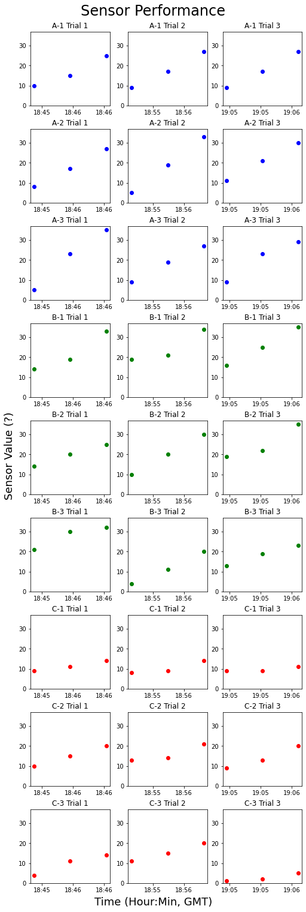
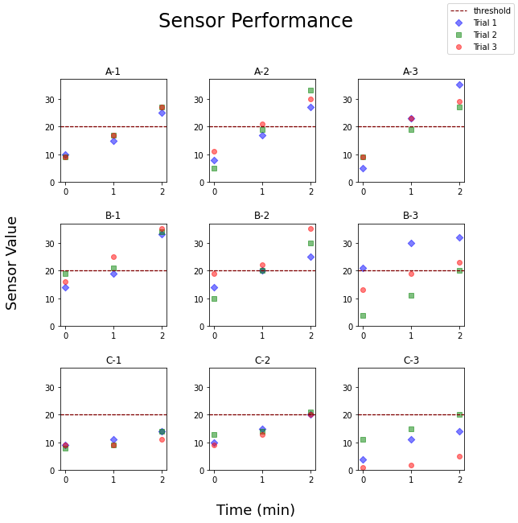

# Data Analysis Workflow with Python
I want to document how data, given in the form of CSV files or similar, can be collected, analyzed, and then reported with Python. The tools I'll use are Python + pandas for the data analysis, Python + matplotlib for plotting, and Python + pandas + Jinja for a LaTeX report. This won't be anything substantive, just minimal example to get the point across of how this workflow goes.

## Step 1: Collect Data
We want to first organize data as best as we can for analysis. This can be a challenge because 'raw' data can come from disparate sources. 

In this demo, I've created some dummy data to reflect a made-up scenario where the data needs to be collected and combined into one place. There are (1) three types of sensors, (2) each sensor has three units, (3) each unit has undergone three trials of data collection, and (4) each trial has three data points. Every sensor has created its own CSV data file.

### File list
The first step is to get a list of all of the data files. The CSV files are all in a "data" folder, and then themselves within their own sub folders. A recursive glob method can find all the CSV files within this folder hierarchy.


```python
from pathlib import Path
data_dir = "data/"
csvs = list(Path(data_dir).rglob('*.csv'))
csvs_print = [str(f) for f in csvs]
csvs_print
```


    ['data\\Sensor A\\A-1.csv',
     'data\\Sensor A\\A-2.csv',
     'data\\Sensor A\\A-3.csv',
     'data\\Sensor B\\B-1.csv',
     'data\\Sensor B\\B-2.csv',
     'data\\Sensor B\\B-3.csv',
     'data\\Sensor C\\C-1.csv',
     'data\\Sensor C\\C-2.csv',
     'data\\Sensor C\\C-3.csv']


### Read Files
Then I can read the CSVs into pandas dataframes.


```python
import pandas as pd

data_dict = {}
for f in csvs:
    data_dict[Path(f).stem] = pd.read_csv(f)

# As an example:
data_dict['A-1']
```


<div>
<style scoped>
    .dataframe tbody tr th:only-of-type {
        vertical-align: middle;
    }

    .dataframe tbody tr th {
        vertical-align: top;
    }

    .dataframe thead th {
        text-align: right;
    }
</style>
<table border="1" class="dataframe">
  <thead>
    <tr style="text-align: right;">
      <th></th>
      <th>Sensor</th>
      <th>Unit #</th>
      <th>Trail</th>
      <th>Time</th>
      <th>Value</th>
    </tr>
  </thead>
  <tbody>
    <tr>
      <th>0</th>
      <td>A</td>
      <td>1</td>
      <td>1</td>
      <td>2022-08-22T13:45:00-05:00</td>
      <td>10</td>
    </tr>
    <tr>
      <th>1</th>
      <td>A</td>
      <td>1</td>
      <td>1</td>
      <td>2022-08-22T13:46:00-05:00</td>
      <td>15</td>
    </tr>
    <tr>
      <th>2</th>
      <td>A</td>
      <td>1</td>
      <td>1</td>
      <td>2022-08-22T13:47:00-05:00</td>
      <td>25</td>
    </tr>
    <tr>
      <th>3</th>
      <td>A</td>
      <td>1</td>
      <td>2</td>
      <td>2022-08-22T13:55:00-05:00</td>
      <td>9</td>
    </tr>
    <tr>
      <th>4</th>
      <td>A</td>
      <td>1</td>
      <td>2</td>
      <td>2022-08-22T13:56:00-05:00</td>
      <td>17</td>
    </tr>
    <tr>
      <th>5</th>
      <td>A</td>
      <td>1</td>
      <td>2</td>
      <td>2022-08-22T13:57:00-05:00</td>
      <td>27</td>
    </tr>
    <tr>
      <th>6</th>
      <td>A</td>
      <td>1</td>
      <td>3</td>
      <td>2022-08-22T14:05:00-05:00</td>
      <td>9</td>
    </tr>
    <tr>
      <th>7</th>
      <td>A</td>
      <td>1</td>
      <td>3</td>
      <td>2022-08-22T14:06:00-05:00</td>
      <td>17</td>
    </tr>
    <tr>
      <th>8</th>
      <td>A</td>
      <td>1</td>
      <td>3</td>
      <td>2022-08-22T14:07:00-05:00</td>
      <td>27</td>
    </tr>
  </tbody>
</table>
</div>


### Combine
Next I will combine the data into one dataframe (this could of been done in one step, but I like breaking it down like this.)


```python
data_df = pd.concat(data_dict.values())
```

Let's examine the combined dataframe to make sure the data looks okay.


```python
data_df
```


<div>
<style scoped>
    .dataframe tbody tr th:only-of-type {
        vertical-align: middle;
    }

    .dataframe tbody tr th {
        vertical-align: top;
    }

    .dataframe thead th {
        text-align: right;
    }
</style>
<table border="1" class="dataframe">
  <thead>
    <tr style="text-align: right;">
      <th></th>
      <th>Sensor</th>
      <th>Unit #</th>
      <th>Trail</th>
      <th>Time</th>
      <th>Value</th>
    </tr>
  </thead>
  <tbody>
    <tr>
      <th>0</th>
      <td>A</td>
      <td>1</td>
      <td>1</td>
      <td>2022-08-22T13:45:00-05:00</td>
      <td>10</td>
    </tr>
    <tr>
      <th>1</th>
      <td>A</td>
      <td>1</td>
      <td>1</td>
      <td>2022-08-22T13:46:00-05:00</td>
      <td>15</td>
    </tr>
    <tr>
      <th>2</th>
      <td>A</td>
      <td>1</td>
      <td>1</td>
      <td>2022-08-22T13:47:00-05:00</td>
      <td>25</td>
    </tr>
    <tr>
      <th>3</th>
      <td>A</td>
      <td>1</td>
      <td>2</td>
      <td>2022-08-22T13:55:00-05:00</td>
      <td>9</td>
    </tr>
    <tr>
      <th>4</th>
      <td>A</td>
      <td>1</td>
      <td>2</td>
      <td>2022-08-22T13:56:00-05:00</td>
      <td>17</td>
    </tr>
    <tr>
      <th>...</th>
      <td>...</td>
      <td>...</td>
      <td>...</td>
      <td>...</td>
      <td>...</td>
    </tr>
    <tr>
      <th>4</th>
      <td>C</td>
      <td>3</td>
      <td>2</td>
      <td>2022-08-22T13:56:00-05:00</td>
      <td>15</td>
    </tr>
    <tr>
      <th>5</th>
      <td>C</td>
      <td>3</td>
      <td>2</td>
      <td>2022-08-22T13:57:00-05:00</td>
      <td>20</td>
    </tr>
    <tr>
      <th>6</th>
      <td>C</td>
      <td>3</td>
      <td>3</td>
      <td>2022-08-22T14:05:00-05:00</td>
      <td>1</td>
    </tr>
    <tr>
      <th>7</th>
      <td>C</td>
      <td>3</td>
      <td>3</td>
      <td>2022-08-22T14:06:00-05:00</td>
      <td>2</td>
    </tr>
    <tr>
      <th>8</th>
      <td>C</td>
      <td>3</td>
      <td>3</td>
      <td>2022-08-22T14:07:00-05:00</td>
      <td>5</td>
    </tr>
  </tbody>
</table>
<p>81 rows × 5 columns</p>
</div>


### Clean
Looks pretty good. One change that needs fixing is the index should be reset.


```python
data_df.reset_index(inplace=True, drop=True)
```

There is also a typo, "Trail" should be "Trial" (whoops). Instead of editing the CSV files, I will just make the change here.


```python
data_df.rename(columns={'Trail' : 'Trial'}, inplace=True)
```

Now let's look at the data types that was automically determined when the CSV was read.


```python
data_df.dtypes
```


    Sensor    object
    Unit #     int64
    Trial      int64
    Time      object
    Value      int64
    dtype: object


The 'Time' column does not have the correct type, it should be 'datetime'. It's not critical here but incorrect date/time data seems to be a common issue, so I'll make a point to correct it.


```python
data_df['Time'] = pd.to_datetime(data_df['Time'])
display(data_df['Time'].dtypes)
# A quick check to make sure it's working
display(data_df['Time'][1] - data_df['Time'][0])
```


    datetime64[ns, pytz.FixedOffset(-300)]


    Timedelta('0 days 00:01:00')


There we go, we've got our data neatly collected in one place and cleaned up a bit.

This dummy data is uniform, so it's straightforward to combine them. But 'real' data can have more variation and quirks. Different Date-time formatting, CSVs with extra columns, data that needs many more corrections, etc. In all cases, care should taken to be sure the data is congruent and correct.

## Step 2: Analysis
This will be a fairly straightforward analysis of the collected data using Python's pandas library. I've tried to highlight some tricks / capabilities of pandas to demonstrate its power.

### Grouping
With pandas, it's easy to group data for analysis. As an example, let's look at descriptive statistics. As seen in the tables below, I can either get statistics for each individual sensor unit or for each sensor type.


```python
descr_stats_by_unit = data_df.groupby(['Sensor','Unit #'])['Value'].agg(['min','max','mean'])
descr_stats_by_unit
```


<div>
<style scoped>
    .dataframe tbody tr th:only-of-type {
        vertical-align: middle;
    }

    .dataframe tbody tr th {
        vertical-align: top;
    }

    .dataframe thead th {
        text-align: right;
    }
</style>
<table border="1" class="dataframe">
  <thead>
    <tr style="text-align: right;">
      <th></th>
      <th></th>
      <th>min</th>
      <th>max</th>
      <th>mean</th>
    </tr>
    <tr>
      <th>Sensor</th>
      <th>Unit #</th>
      <th></th>
      <th></th>
      <th></th>
    </tr>
  </thead>
  <tbody>
    <tr>
      <th rowspan="3" valign="top">A</th>
      <th>1</th>
      <td>9</td>
      <td>27</td>
      <td>17.333333</td>
    </tr>
    <tr>
      <th>2</th>
      <td>5</td>
      <td>33</td>
      <td>19.000000</td>
    </tr>
    <tr>
      <th>3</th>
      <td>5</td>
      <td>35</td>
      <td>19.888889</td>
    </tr>
    <tr>
      <th rowspan="3" valign="top">B</th>
      <th>1</th>
      <td>14</td>
      <td>35</td>
      <td>24.000000</td>
    </tr>
    <tr>
      <th>2</th>
      <td>10</td>
      <td>35</td>
      <td>21.666667</td>
    </tr>
    <tr>
      <th>3</th>
      <td>4</td>
      <td>32</td>
      <td>19.222222</td>
    </tr>
    <tr>
      <th rowspan="3" valign="top">C</th>
      <th>1</th>
      <td>8</td>
      <td>14</td>
      <td>10.444444</td>
    </tr>
    <tr>
      <th>2</th>
      <td>9</td>
      <td>21</td>
      <td>15.000000</td>
    </tr>
    <tr>
      <th>3</th>
      <td>1</td>
      <td>20</td>
      <td>9.222222</td>
    </tr>
  </tbody>
</table>
</div>


```python
descr_stats_by_sensor = data_df.groupby(['Sensor'])['Value'].agg(['min','max','mean'])
descr_stats_by_sensor
```


<div>
<style scoped>
    .dataframe tbody tr th:only-of-type {
        vertical-align: middle;
    }

    .dataframe tbody tr th {
        vertical-align: top;
    }

    .dataframe thead th {
        text-align: right;
    }
</style>
<table border="1" class="dataframe">
  <thead>
    <tr style="text-align: right;">
      <th></th>
      <th>min</th>
      <th>max</th>
      <th>mean</th>
    </tr>
    <tr>
      <th>Sensor</th>
      <th></th>
      <th></th>
      <th></th>
    </tr>
  </thead>
  <tbody>
    <tr>
      <th>A</th>
      <td>5</td>
      <td>35</td>
      <td>18.740741</td>
    </tr>
    <tr>
      <th>B</th>
      <td>4</td>
      <td>35</td>
      <td>21.629630</td>
    </tr>
    <tr>
      <th>C</th>
      <td>1</td>
      <td>21</td>
      <td>11.555556</td>
    </tr>
  </tbody>
</table>
</div>


### Scoring
Assigning a pass/fail or similar scoring metric may be part of the analysis.

I've made up a scoring sytem for this scenario: 
- A Trial is a "Pass" if the sensor reached over 20 in a Trial.
- A unit is a "Pass" if all of its associated Trials are a "Pass".
- A sensor is a "Pass" if all of its associated Trials are a "Pass".

With the ability to group data, I can build out the scoring analysis throughout the different "levels" of data, starting with "by trail" and ending with "by sensor".


```python
# By Trial
trial_score = data_df.groupby(['Sensor','Unit #', 'Trial'])['Value'].agg(['max'])
trial_score['Pass?'] = trial_score['max'].apply(lambda c: True if c >= 20 else False)
trial_score['Score'] = trial_score['Pass?'].map({True: 'Pass', False: 'Fail'})
trial_score_display = trial_score[['max','Score']]
trial_score
```


<div>
<style scoped>
    .dataframe tbody tr th:only-of-type {
        vertical-align: middle;
    }

    .dataframe tbody tr th {
        vertical-align: top;
    }

    .dataframe thead th {
        text-align: right;
    }
</style>
<table border="1" class="dataframe">
  <thead>
    <tr style="text-align: right;">
      <th></th>
      <th></th>
      <th></th>
      <th>max</th>
      <th>Pass?</th>
      <th>Score</th>
    </tr>
    <tr>
      <th>Sensor</th>
      <th>Unit #</th>
      <th>Trial</th>
      <th></th>
      <th></th>
      <th></th>
    </tr>
  </thead>
  <tbody>
    <tr>
      <th rowspan="9" valign="top">A</th>
      <th rowspan="3" valign="top">1</th>
      <th>1</th>
      <td>25</td>
      <td>True</td>
      <td>Pass</td>
    </tr>
    <tr>
      <th>2</th>
      <td>27</td>
      <td>True</td>
      <td>Pass</td>
    </tr>
    <tr>
      <th>3</th>
      <td>27</td>
      <td>True</td>
      <td>Pass</td>
    </tr>
    <tr>
      <th rowspan="3" valign="top">2</th>
      <th>1</th>
      <td>27</td>
      <td>True</td>
      <td>Pass</td>
    </tr>
    <tr>
      <th>2</th>
      <td>33</td>
      <td>True</td>
      <td>Pass</td>
    </tr>
    <tr>
      <th>3</th>
      <td>30</td>
      <td>True</td>
      <td>Pass</td>
    </tr>
    <tr>
      <th rowspan="3" valign="top">3</th>
      <th>1</th>
      <td>35</td>
      <td>True</td>
      <td>Pass</td>
    </tr>
    <tr>
      <th>2</th>
      <td>27</td>
      <td>True</td>
      <td>Pass</td>
    </tr>
    <tr>
      <th>3</th>
      <td>29</td>
      <td>True</td>
      <td>Pass</td>
    </tr>
    <tr>
      <th rowspan="9" valign="top">B</th>
      <th rowspan="3" valign="top">1</th>
      <th>1</th>
      <td>33</td>
      <td>True</td>
      <td>Pass</td>
    </tr>
    <tr>
      <th>2</th>
      <td>34</td>
      <td>True</td>
      <td>Pass</td>
    </tr>
    <tr>
      <th>3</th>
      <td>35</td>
      <td>True</td>
      <td>Pass</td>
    </tr>
    <tr>
      <th rowspan="3" valign="top">2</th>
      <th>1</th>
      <td>25</td>
      <td>True</td>
      <td>Pass</td>
    </tr>
    <tr>
      <th>2</th>
      <td>30</td>
      <td>True</td>
      <td>Pass</td>
    </tr>
    <tr>
      <th>3</th>
      <td>35</td>
      <td>True</td>
      <td>Pass</td>
    </tr>
    <tr>
      <th rowspan="3" valign="top">3</th>
      <th>1</th>
      <td>32</td>
      <td>True</td>
      <td>Pass</td>
    </tr>
    <tr>
      <th>2</th>
      <td>20</td>
      <td>True</td>
      <td>Pass</td>
    </tr>
    <tr>
      <th>3</th>
      <td>23</td>
      <td>True</td>
      <td>Pass</td>
    </tr>
    <tr>
      <th rowspan="9" valign="top">C</th>
      <th rowspan="3" valign="top">1</th>
      <th>1</th>
      <td>14</td>
      <td>False</td>
      <td>Fail</td>
    </tr>
    <tr>
      <th>2</th>
      <td>14</td>
      <td>False</td>
      <td>Fail</td>
    </tr>
    <tr>
      <th>3</th>
      <td>11</td>
      <td>False</td>
      <td>Fail</td>
    </tr>
    <tr>
      <th rowspan="3" valign="top">2</th>
      <th>1</th>
      <td>20</td>
      <td>True</td>
      <td>Pass</td>
    </tr>
    <tr>
      <th>2</th>
      <td>21</td>
      <td>True</td>
      <td>Pass</td>
    </tr>
    <tr>
      <th>3</th>
      <td>20</td>
      <td>True</td>
      <td>Pass</td>
    </tr>
    <tr>
      <th rowspan="3" valign="top">3</th>
      <th>1</th>
      <td>14</td>
      <td>False</td>
      <td>Fail</td>
    </tr>
    <tr>
      <th>2</th>
      <td>20</td>
      <td>True</td>
      <td>Pass</td>
    </tr>
    <tr>
      <th>3</th>
      <td>5</td>
      <td>False</td>
      <td>Fail</td>
    </tr>
  </tbody>
</table>
</div>


```python
# By unit
unit_score = trial_score.groupby(['Sensor', 'Unit #'])['Pass?'].agg(['sum'])
unit_score.rename(columns={'sum' : 'Trials Passed'}, inplace=True)
unit_score['Trials Total'] =  trial_score.groupby(['Sensor', 'Unit #'])['Pass?'].agg(['count'])
unit_score['Trials %'] = unit_score['Trials Passed'] / unit_score['Trials Total']
unit_score['Trials'] = unit_score['Trials Passed'].astype(str) + "/" + unit_score['Trials Total'].astype(str)
trial_score_cat = trial_score.astype("category")
unit_score['Pass?'] = trial_score_cat.groupby(['Sensor', 'Unit #'])['Pass?'].agg(['all'])
unit_score['Score'] = unit_score['Pass?'].map({True: 'Pass', False: 'Fail'})
unit_score_display = unit_score[['Trials', 'Score']]
unit_score
```


<div>
<style scoped>
    .dataframe tbody tr th:only-of-type {
        vertical-align: middle;
    }

    .dataframe tbody tr th {
        vertical-align: top;
    }

    .dataframe thead th {
        text-align: right;
    }
</style>
<table border="1" class="dataframe">
  <thead>
    <tr style="text-align: right;">
      <th></th>
      <th></th>
      <th>Trials Passed</th>
      <th>Trials Total</th>
      <th>Trials %</th>
      <th>Trials</th>
      <th>Pass?</th>
      <th>Score</th>
    </tr>
    <tr>
      <th>Sensor</th>
      <th>Unit #</th>
      <th></th>
      <th></th>
      <th></th>
      <th></th>
      <th></th>
      <th></th>
    </tr>
  </thead>
  <tbody>
    <tr>
      <th rowspan="3" valign="top">A</th>
      <th>1</th>
      <td>3</td>
      <td>3</td>
      <td>1.000000</td>
      <td>3/3</td>
      <td>True</td>
      <td>Pass</td>
    </tr>
    <tr>
      <th>2</th>
      <td>3</td>
      <td>3</td>
      <td>1.000000</td>
      <td>3/3</td>
      <td>True</td>
      <td>Pass</td>
    </tr>
    <tr>
      <th>3</th>
      <td>3</td>
      <td>3</td>
      <td>1.000000</td>
      <td>3/3</td>
      <td>True</td>
      <td>Pass</td>
    </tr>
    <tr>
      <th rowspan="3" valign="top">B</th>
      <th>1</th>
      <td>3</td>
      <td>3</td>
      <td>1.000000</td>
      <td>3/3</td>
      <td>True</td>
      <td>Pass</td>
    </tr>
    <tr>
      <th>2</th>
      <td>3</td>
      <td>3</td>
      <td>1.000000</td>
      <td>3/3</td>
      <td>True</td>
      <td>Pass</td>
    </tr>
    <tr>
      <th>3</th>
      <td>3</td>
      <td>3</td>
      <td>1.000000</td>
      <td>3/3</td>
      <td>True</td>
      <td>Pass</td>
    </tr>
    <tr>
      <th rowspan="3" valign="top">C</th>
      <th>1</th>
      <td>0</td>
      <td>3</td>
      <td>0.000000</td>
      <td>0/3</td>
      <td>False</td>
      <td>Fail</td>
    </tr>
    <tr>
      <th>2</th>
      <td>3</td>
      <td>3</td>
      <td>1.000000</td>
      <td>3/3</td>
      <td>True</td>
      <td>Pass</td>
    </tr>
    <tr>
      <th>3</th>
      <td>1</td>
      <td>3</td>
      <td>0.333333</td>
      <td>1/3</td>
      <td>False</td>
      <td>Fail</td>
    </tr>
  </tbody>
</table>
</div>


```python
# By Sensor
sensor_score = trial_score.groupby(['Sensor'])['Pass?'].agg(['sum'])
sensor_score.rename(columns={'sum' : 'Trials Passed'}, inplace=True)
sensor_score['Trials Total'] = trial_score.groupby(['Sensor'])['Pass?'].agg(['count'])
sensor_score['Trials %'] = sensor_score['Trials Passed'] / sensor_score['Trials Total']
sensor_score['Trials By Unit'] = unit_score.groupby(['Sensor'])['Trials'].apply(lambda x: '; '.join(x))
sensor_score['Trials Total'] = sensor_score['Trials Passed'].astype(str) + "/" + sensor_score['Trials Total'].astype(str)
sensor_score['Units Passed'] = unit_score.groupby(['Sensor'])['Pass?'].agg(['sum'])
sensor_score['Units Total'] = unit_score.groupby(['Sensor'])['Pass?'].agg(['count'])
sensor_score['Units %'] = sensor_score['Units Passed'] / sensor_score['Units Total']
sensor_score['Units'] = sensor_score['Units Passed'].astype(str) + "/" + sensor_score['Units Total'].astype(str)
sensor_score['Pass?']  = trial_score.groupby(['Sensor'])['Pass?'].agg(['all'])
sensor_score['Score'] = sensor_score['Pass?'].map({True: 'Pass', False: 'Fail'})
sensor_score_display = sensor_score[['Trials By Unit', 'Trials Total', 'Units', 'Score']]
sensor_score
```


<div>
<style scoped>
    .dataframe tbody tr th:only-of-type {
        vertical-align: middle;
    }

    .dataframe tbody tr th {
        vertical-align: top;
    }

    .dataframe thead th {
        text-align: right;
    }
</style>
<table border="1" class="dataframe">
  <thead>
    <tr style="text-align: right;">
      <th></th>
      <th>Trials Passed</th>
      <th>Trials Total</th>
      <th>Trials %</th>
      <th>Trials By Unit</th>
      <th>Units Passed</th>
      <th>Units Total</th>
      <th>Units %</th>
      <th>Units</th>
      <th>Pass?</th>
      <th>Score</th>
    </tr>
    <tr>
      <th>Sensor</th>
      <th></th>
      <th></th>
      <th></th>
      <th></th>
      <th></th>
      <th></th>
      <th></th>
      <th></th>
      <th></th>
      <th></th>
    </tr>
  </thead>
  <tbody>
    <tr>
      <th>A</th>
      <td>9</td>
      <td>9/9</td>
      <td>1.000000</td>
      <td>3/3; 3/3; 3/3</td>
      <td>3</td>
      <td>3</td>
      <td>1.000000</td>
      <td>3/3</td>
      <td>True</td>
      <td>Pass</td>
    </tr>
    <tr>
      <th>B</th>
      <td>9</td>
      <td>9/9</td>
      <td>1.000000</td>
      <td>3/3; 3/3; 3/3</td>
      <td>3</td>
      <td>3</td>
      <td>1.000000</td>
      <td>3/3</td>
      <td>True</td>
      <td>Pass</td>
    </tr>
    <tr>
      <th>C</th>
      <td>4</td>
      <td>4/9</td>
      <td>0.444444</td>
      <td>0/3; 3/3; 1/3</td>
      <td>1</td>
      <td>3</td>
      <td>0.333333</td>
      <td>1/3</td>
      <td>False</td>
      <td>Fail</td>
    </tr>
  </tbody>
</table>
</div>


### Plots

Pandas has built in methods to plot data, which use the matplotlib library by default. However, these methods can be cumbersome for some cases. I almost always skip them and use matplotlib "as is".

Below I've made two plots to demo matplotlib. The first was a result of my intuition to first try plotting every trial. It's a good example of how to get pandas grouping and matplotlib plotting to work together. However, I realized it could be improved by plotting by sensor unit, which is seen in the second plot.


```python
import matplotlib.pyplot as plt
import matplotlib.dates as mdates
import matplotlib.ticker as ticker
fig, axs = plt.subplots(9,3,figsize=(7,21),constrained_layout=True)
grouped = data_df.groupby(['Sensor','Unit #','Trial'])
targets = zip(grouped.groups.keys(), axs.flatten())
fig.suptitle('Sensor Performance', fontsize=24)
fig.supxlabel('Time (Hour:Min, GMT)', fontsize=18)
fig.supylabel('Sensor Value (?)', fontsize=18)
for i, (key, ax) in enumerate(targets):
    unit=key[0]
    unit_num=key[1]
    trial_num=key[2]
    ax.set_title(f"{unit}-{unit_num} Trial {trial_num}")
    if unit == 'A':
        color = 'blue'
    elif unit == 'B':
        color = 'green'
    else:
        color = 'red'
    dfg = grouped.get_group(key)
    ax.scatter(dfg['Time'],dfg['Value'],color=color)
    ax.xaxis.set_major_formatter(mdates.DateFormatter('%H:%M'))
    ax.set_ylim([0,37])
    ax.xaxis.set_major_locator(ticker.MaxNLocator(nbins=3))
#plt.savefig('plots/sensor_performance_by_trail.jpg')
plt.show()
```


    

    


```python
import matplotlib.pyplot as plt
import matplotlib.dates as mdates
import matplotlib.ticker as ticker
fig, axs = plt.subplots(3,3,figsize=(9,9))
grouped = data_df.groupby(['Sensor','Unit #'])
targets = zip(grouped.groups.keys(), axs.flatten())
fig.suptitle('Sensor Performance', fontsize=24)
fig.supxlabel('Time (min)', fontsize=18)
fig.supylabel('Sensor Value', fontsize=18)
for i, (key, ax) in enumerate(targets):
    unit=key[0]
    unit_num=key[1]
    ax.set_title(f"{unit}-{unit_num}")
    dfg = grouped.get_group(key)
    for i, (Trial,dfTrial) in enumerate(dfg.groupby(['Trial'])):
        dfTrial = dfTrial.reset_index(drop=True)
        dfTrial = dfTrial.reset_index()
        if Trial == 1:
            color = 'blue'
            marker = 'D'
        elif Trial == 2:
            color = 'green'
            marker = 's'
        else:
            color = 'red'
            marker = 'o'
        ax.axhline(y=20, color='maroon', linestyle='--', label="threshold",linewidth=1.1)
        ax.scatter(dfTrial['index'],dfTrial['Value'],color=color,label=f'Trial {Trial}', alpha=.5, marker=marker)
    ax.set_ylim([0,37])
    ax.xaxis.set_major_locator(ticker.MaxNLocator(integer=True))
handles, labels = plt.gca().get_legend_handles_labels()
by_label = dict(zip(labels, handles)) # removes duplicate legends
fig.subplots_adjust(top=0.85,bottom=0.1, hspace = 0.4, wspace = 0.4)
fig.legend(by_label.values(), by_label.keys(), loc='upper right')
plt.savefig('plots/sensor_performance_by_unit.jpg')
plt.show()
```


    

    


## Step 3: Report

Now that I've done the analysis with Python, I want to present those results in a LaTeX document. I just use LaTeX because I'm familiar with it through work and know lots of other folks do too, but I would think a Juypter notebook like this one would work just as well.

### Tables
Panda has a ['to_latex'](https://pandas.pydata.org/docs/reference/api/pandas.io.formats.style.Styler.to_latex.html) method for converting dataframes to LaTeX table code. It is decent, but not as good as its HTML/CSS counterpart because it is lacking features and has a few bugs. I've managed to make it work through some workarounds. I've especially found it works out better to aim for a "half-way" solution that you can be tailored and polished later in the LaTeX editor (e.g. Overleaf).

I'm going to show how two different styles of LaTeX tables can be achieved. One is the booktabs style, which I think most people use and prefer. The other is what might be considered the default "lines" table.

#### Booktabs style


```python
import re

def text_to_latex(text):
    # lazy funciton to fix symbols for LaTeX
    if isinstance(text, str):
        if text == "nan":
            return ""
        else:
            if "%" in text:
                text = re.sub(r"%", r"\%", text)
            if "&" in text:
                text = re.sub("&", r"\&", text)
            if "μ" in text:
                text = text.replace("μ", r"$\mu$")
            if "" in text:
                text = text.replace("Δ", r"$\delta$")
            if "_" in text:
                text = text.replace("_", r"\_")
            if "#" in text:
                text = text.replace("#", r"\#")
            if "\n" in text:
               text = text.replace("\n", " \\newline ")
            # if "Unnamed" in text:
            #     text = " "
    return text

def fix_multi_row_for_longtable(latex):
    # see multirow package documentation for how this works
    lines = latex.split('\n')
    body_start = False
    last_starred = -1
    for i, l in enumerate(lines):
        if "endlastfoot" in l:
            body_start = True
            continue
        if body_start:
            if 'multirow' in l or 'end{longtable}' in l:
                if last_starred != -1:
                    lines[last_starred] = lines[last_starred].replace(r'\\*',r'\\')
            if r'\\' in l:
                lines[i] = lines[i].replace(r'\\',r'\\*')
                last_starred = i
    return '\n'.join(lines)

def passfail(c):
    # applies color to cells with "pass" or "fail" in them.
    if c.lower() == 'pass':
        color = "light-green"
    elif c.lower() == 'fail':
        color = 'light-red'
    else:
        return None
    return f"background-color:{color};"

def color_fract(c, denom):
    if isinstance(c, str):
        pattern_search = fr"([^{denom}]/{denom})"
        pattern_replace = r'\\textcolor{red}{\1}'
        sub = re.sub(pattern_search, pattern_replace, str(c))
    else:
        return c
    return sub
def bold(c):
    return f"textbf:--rwrap;"

# list of dataframes going to convert to LateX code
df_to_latex_tbl_list = [descr_stats_by_unit, descr_stats_by_sensor, trial_score_display, unit_score_display, sensor_score_display]
captions = ["Sensor performance descriptive statistics by unit.",
           "Sensor performance descriptive statistics by sensor.",
           "Sensor perforamnce scoring by trail.",
           "Sensor perforamnce scoring by unit.",
           "Sensor perforamnce scoring by trail."]
latex_tables = []
for df, caption in zip(df_to_latex_tbl_list, captions):
    tdf = df.copy()
    # apply replacements for certain symbols for LaTeX
    tdf = tdf.applymap(text_to_latex)
    tdf.columns = pd.Series(tdf.columns).apply(text_to_latex)
    tdf.index.names = pd.Series(tdf.index.names).apply(text_to_latex)
    # additional colors for scores (easier avoid styler for this)
    tdf = tdf.applymap(color_fract,denom=3)
    tdf = tdf.applymap(color_fract,denom=9)
    display(tdf)
    # styler
    styler = tdf.style
    styler.applymap_index(bold, axis="columns")
    styler.applymap_index(bold, axis="index")
    styler.format({'mean' : '{:.2f}', 'Trials \%' : '{:.2f}', 'Units \%' : '{:.2f}' })
    if "Score" in list(tdf.columns):
        styler.applymap(passfail, subset="Score")
    # I cannot figure out how to apply style to multi index names, so I am doing so "manually"
    tdf.index.names = pd.Series(tdf.index.names).apply(lambda v: rf'\textbf{{{v}}}')
    tbl = styler.to_latex(environment="longtable", position="H", caption=caption, hrules=True, convert_css=True)
    tbl = fix_multi_row_for_longtable(tbl)
    # apply some additional color
    latex_tables.append(tbl)
    
```


<div>
<style scoped>
    .dataframe tbody tr th:only-of-type {
        vertical-align: middle;
    }

    .dataframe tbody tr th {
        vertical-align: top;
    }

    .dataframe thead th {
        text-align: right;
    }
</style>
<table border="1" class="dataframe">
  <thead>
    <tr style="text-align: right;">
      <th></th>
      <th></th>
      <th>min</th>
      <th>max</th>
      <th>mean</th>
    </tr>
    <tr>
      <th>Sensor</th>
      <th>Unit \#</th>
      <th></th>
      <th></th>
      <th></th>
    </tr>
  </thead>
  <tbody>
    <tr>
      <th rowspan="3" valign="top">A</th>
      <th>1</th>
      <td>9</td>
      <td>27</td>
      <td>17.333333</td>
    </tr>
    <tr>
      <th>2</th>
      <td>5</td>
      <td>33</td>
      <td>19.000000</td>
    </tr>
    <tr>
      <th>3</th>
      <td>5</td>
      <td>35</td>
      <td>19.888889</td>
    </tr>
    <tr>
      <th rowspan="3" valign="top">B</th>
      <th>1</th>
      <td>14</td>
      <td>35</td>
      <td>24.000000</td>
    </tr>
    <tr>
      <th>2</th>
      <td>10</td>
      <td>35</td>
      <td>21.666667</td>
    </tr>
    <tr>
      <th>3</th>
      <td>4</td>
      <td>32</td>
      <td>19.222222</td>
    </tr>
    <tr>
      <th rowspan="3" valign="top">C</th>
      <th>1</th>
      <td>8</td>
      <td>14</td>
      <td>10.444444</td>
    </tr>
    <tr>
      <th>2</th>
      <td>9</td>
      <td>21</td>
      <td>15.000000</td>
    </tr>
    <tr>
      <th>3</th>
      <td>1</td>
      <td>20</td>
      <td>9.222222</td>
    </tr>
  </tbody>
</table>
</div>


<div>
<style scoped>
    .dataframe tbody tr th:only-of-type {
        vertical-align: middle;
    }

    .dataframe tbody tr th {
        vertical-align: top;
    }

    .dataframe thead th {
        text-align: right;
    }
</style>
<table border="1" class="dataframe">
  <thead>
    <tr style="text-align: right;">
      <th></th>
      <th>min</th>
      <th>max</th>
      <th>mean</th>
    </tr>
    <tr>
      <th>Sensor</th>
      <th></th>
      <th></th>
      <th></th>
    </tr>
  </thead>
  <tbody>
    <tr>
      <th>A</th>
      <td>5</td>
      <td>35</td>
      <td>18.740741</td>
    </tr>
    <tr>
      <th>B</th>
      <td>4</td>
      <td>35</td>
      <td>21.629630</td>
    </tr>
    <tr>
      <th>C</th>
      <td>1</td>
      <td>21</td>
      <td>11.555556</td>
    </tr>
  </tbody>
</table>
</div>


<div>
<style scoped>
    .dataframe tbody tr th:only-of-type {
        vertical-align: middle;
    }

    .dataframe tbody tr th {
        vertical-align: top;
    }

    .dataframe thead th {
        text-align: right;
    }
</style>
<table border="1" class="dataframe">
  <thead>
    <tr style="text-align: right;">
      <th></th>
      <th></th>
      <th></th>
      <th>max</th>
      <th>Score</th>
    </tr>
    <tr>
      <th>Sensor</th>
      <th>Unit \#</th>
      <th>Trial</th>
      <th></th>
      <th></th>
    </tr>
  </thead>
  <tbody>
    <tr>
      <th rowspan="9" valign="top">A</th>
      <th rowspan="3" valign="top">1</th>
      <th>1</th>
      <td>25</td>
      <td>Pass</td>
    </tr>
    <tr>
      <th>2</th>
      <td>27</td>
      <td>Pass</td>
    </tr>
    <tr>
      <th>3</th>
      <td>27</td>
      <td>Pass</td>
    </tr>
    <tr>
      <th rowspan="3" valign="top">2</th>
      <th>1</th>
      <td>27</td>
      <td>Pass</td>
    </tr>
    <tr>
      <th>2</th>
      <td>33</td>
      <td>Pass</td>
    </tr>
    <tr>
      <th>3</th>
      <td>30</td>
      <td>Pass</td>
    </tr>
    <tr>
      <th rowspan="3" valign="top">3</th>
      <th>1</th>
      <td>35</td>
      <td>Pass</td>
    </tr>
    <tr>
      <th>2</th>
      <td>27</td>
      <td>Pass</td>
    </tr>
    <tr>
      <th>3</th>
      <td>29</td>
      <td>Pass</td>
    </tr>
    <tr>
      <th rowspan="9" valign="top">B</th>
      <th rowspan="3" valign="top">1</th>
      <th>1</th>
      <td>33</td>
      <td>Pass</td>
    </tr>
    <tr>
      <th>2</th>
      <td>34</td>
      <td>Pass</td>
    </tr>
    <tr>
      <th>3</th>
      <td>35</td>
      <td>Pass</td>
    </tr>
    <tr>
      <th rowspan="3" valign="top">2</th>
      <th>1</th>
      <td>25</td>
      <td>Pass</td>
    </tr>
    <tr>
      <th>2</th>
      <td>30</td>
      <td>Pass</td>
    </tr>
    <tr>
      <th>3</th>
      <td>35</td>
      <td>Pass</td>
    </tr>
    <tr>
      <th rowspan="3" valign="top">3</th>
      <th>1</th>
      <td>32</td>
      <td>Pass</td>
    </tr>
    <tr>
      <th>2</th>
      <td>20</td>
      <td>Pass</td>
    </tr>
    <tr>
      <th>3</th>
      <td>23</td>
      <td>Pass</td>
    </tr>
    <tr>
      <th rowspan="9" valign="top">C</th>
      <th rowspan="3" valign="top">1</th>
      <th>1</th>
      <td>14</td>
      <td>Fail</td>
    </tr>
    <tr>
      <th>2</th>
      <td>14</td>
      <td>Fail</td>
    </tr>
    <tr>
      <th>3</th>
      <td>11</td>
      <td>Fail</td>
    </tr>
    <tr>
      <th rowspan="3" valign="top">2</th>
      <th>1</th>
      <td>20</td>
      <td>Pass</td>
    </tr>
    <tr>
      <th>2</th>
      <td>21</td>
      <td>Pass</td>
    </tr>
    <tr>
      <th>3</th>
      <td>20</td>
      <td>Pass</td>
    </tr>
    <tr>
      <th rowspan="3" valign="top">3</th>
      <th>1</th>
      <td>14</td>
      <td>Fail</td>
    </tr>
    <tr>
      <th>2</th>
      <td>20</td>
      <td>Pass</td>
    </tr>
    <tr>
      <th>3</th>
      <td>5</td>
      <td>Fail</td>
    </tr>
  </tbody>
</table>
</div>


<div>
<style scoped>
    .dataframe tbody tr th:only-of-type {
        vertical-align: middle;
    }

    .dataframe tbody tr th {
        vertical-align: top;
    }

    .dataframe thead th {
        text-align: right;
    }
</style>
<table border="1" class="dataframe">
  <thead>
    <tr style="text-align: right;">
      <th></th>
      <th></th>
      <th>Trials</th>
      <th>Score</th>
    </tr>
    <tr>
      <th>Sensor</th>
      <th>Unit \#</th>
      <th></th>
      <th></th>
    </tr>
  </thead>
  <tbody>
    <tr>
      <th rowspan="3" valign="top">A</th>
      <th>1</th>
      <td>3/3</td>
      <td>Pass</td>
    </tr>
    <tr>
      <th>2</th>
      <td>3/3</td>
      <td>Pass</td>
    </tr>
    <tr>
      <th>3</th>
      <td>3/3</td>
      <td>Pass</td>
    </tr>
    <tr>
      <th rowspan="3" valign="top">B</th>
      <th>1</th>
      <td>3/3</td>
      <td>Pass</td>
    </tr>
    <tr>
      <th>2</th>
      <td>3/3</td>
      <td>Pass</td>
    </tr>
    <tr>
      <th>3</th>
      <td>3/3</td>
      <td>Pass</td>
    </tr>
    <tr>
      <th rowspan="3" valign="top">C</th>
      <th>1</th>
      <td>\textcolor{red}{0/3}</td>
      <td>Fail</td>
    </tr>
    <tr>
      <th>2</th>
      <td>3/3</td>
      <td>Pass</td>
    </tr>
    <tr>
      <th>3</th>
      <td>\textcolor{red}{1/3}</td>
      <td>Fail</td>
    </tr>
  </tbody>
</table>
</div>


<div>
<style scoped>
    .dataframe tbody tr th:only-of-type {
        vertical-align: middle;
    }

    .dataframe tbody tr th {
        vertical-align: top;
    }

    .dataframe thead th {
        text-align: right;
    }
</style>
<table border="1" class="dataframe">
  <thead>
    <tr style="text-align: right;">
      <th></th>
      <th>Trials By Unit</th>
      <th>Trials Total</th>
      <th>Units</th>
      <th>Score</th>
    </tr>
    <tr>
      <th>Sensor</th>
      <th></th>
      <th></th>
      <th></th>
      <th></th>
    </tr>
  </thead>
  <tbody>
    <tr>
      <th>A</th>
      <td>3/3; 3/3; 3/3</td>
      <td>9/9</td>
      <td>3/3</td>
      <td>Pass</td>
    </tr>
    <tr>
      <th>B</th>
      <td>3/3; 3/3; 3/3</td>
      <td>9/9</td>
      <td>3/3</td>
      <td>Pass</td>
    </tr>
    <tr>
      <th>C</th>
      <td>\textcolor{red}{0/3}; 3/3; \textcolor{red}{1/3}</td>
      <td>\textcolor{red}{4/9}</td>
      <td>\textcolor{red}{1/3}</td>
      <td>Fail</td>
    </tr>
  </tbody>
</table>
</div>


#### "Lines" Style


```python
import jinja2
def build_col_format(head, style_col_format, vline=True):
    # function to build column format string for LaTeX tables.
    # Especially needed for those that have vertical lines.
    # e.g. for a 3 column table: "|l|l|l|"
    #                in context: \begin{longtable}{|l|l|l|}{...}
    if "default" not in style_col_format:
        style_col_format["default"] = "l"
    col_format = ""
    for i, c in enumerate(head):
        if c in style_col_format:
            col_type = style_col_format[c]
        else:
            col_type = style_col_format["default"]
        if i == 0:
            if vline == True:
                col_type = "|" + col_type
        col_format += col_type
    if vline == True and col_format[-1] != "|":
        col_format += "|"
    return col_format

templates_dir = "templates/"
table_template_fn = "longtable_default_custom.tex"
# set-up Jinja template environment
templateLoader = jinja2.FileSystemLoader(searchpath=templates_dir)
templateEnv = jinja2.Environment(loader=templateLoader, trim_blocks=True)
table_template = templateEnv.get_template(table_template_fn)

for df, caption in zip(df_to_latex_tbl_list, captions):
    tdf = df.copy()
    head = list(tdf.index.names) + list(tdf.columns)
    style_col_format = {"default" : "c|"}
    column_format = build_col_format(head, style_col_format)
    ## apply replacements for certain symbols for LaTeX
    tdf = tdf.applymap(text_to_latex)
    tdf.columns = pd.Series(tdf.columns).apply(text_to_latex)
    tdf.index.names = pd.Series(tdf.index.names).apply(text_to_latex)
    # additional colors for scores (easier avoid styler for this)
    tdf = tdf.applymap(color_fract,denom=3)
    tdf = tdf.applymap(color_fract,denom=9)
    # styler
    styler = tdf.style
    styler.template_latex = table_template
    styler.applymap_index(bold, axis="columns")
    styler.applymap_index(bold, axis="index")
    styler.format({'mean' : '{:.2f}', 'Trials \%' : '{:.2f}', 'Units \%' : '{:.2f}' })
    if "Score" in list(tdf.columns):
        styler.applymap(passfail, subset="Score")
    # I cannot figure out how to apply style to multi index names, so I am doing so "manually"
    tdf.index.names = pd.Series(tdf.index.names).apply(lambda v: rf'\textbf{{{v}}}')
    # add other data for custom template, to fix/adjust a few things
    templateEnv.globals.update(hlines=False, hlines_head=True, colnum=len(head),head_color='light-gray')
    tbl = styler.to_latex(environment="longtable",position="H", caption=caption+" (lines style)",
                          column_format=column_format,convert_css=True, clines="all;index")
    tbl = fix_multi_row_for_longtable(tbl)
    latex_tables.append(tbl)
```

### Figures
The plots can be added through figures within LaTeX. Even though the code is simple, I've went ahead and created a seperate template for them.


```python
fig_template_fn = "figure_template.tex"
# set-up Jinja template environment
templateLoader = jinja2.FileSystemLoader(searchpath=templates_dir)
templateEnv = jinja2.Environment(loader=templateLoader, trim_blocks=True)
table_template = templateEnv.get_template(fig_template_fn)

plots = [str(f.name) for f in list(Path('plots/').glob('*.jpg'))]
captions = ["Sensor Performance scatter plot all trails", "Sensor perforamance scatter plot by unit."]
latex_plots = []
for p, caption in zip(plots,captions):
    latex_plots.append(table_template.render(position="H",caption=caption, img_name=p))
```

### Report Template
I'll use a very basic LaTeX "report" template with Jinja and then use the results data to generate the document. This template can be as complex or as simple as needed, depending perhaps on how much of the report outline is already known. The template I'm using here is just a starting point, good for testing that the elements compile correctly and ready to go where needed. I think it's especially useful for when there are a high number of tables and/or plots, altough of course that's not the case here. For actual documents that are pretty simple, it may be make more sense to skip template engines and just save the plots and/or LaTeX table code then figure it out in a LaTeX editor later.

The code is printed below and the resulting PDF (compiled in Overleaf) can be seen [here](analysis_pipeline_latex_report.pdf). Again, these table and plots probably aren't perfect, just getting them mostly complete and ready for refinement is what I'm after.


```python
templates_dir = "templates/"
report_template_fn = "analysis_report.tex"
# set-up Jinja template environment
templateLoader = jinja2.FileSystemLoader(searchpath=templates_dir)
templateEnv = jinja2.Environment(loader=templateLoader, trim_blocks=True)
report_template = templateEnv.get_template(report_template_fn)
latex_plots = [latex_plots[1]] # only taking second plot
print(report_template.render(plots = latex_plots, tables = latex_tables))

```

    \documentclass{article}
    \usepackage[utf8]{inputenc}
    \RequirePackage{longtable}
    \RequirePackage[table]{xcolor}
    \RequirePackage{color, colortbl}
    \RequirePackage{graphicx}
    \RequirePackage{booktabs}
    \RequirePackage[longtable]{multirow}
    \RequirePackage{float}
    
    \title{Demo for Analysis Pipeline}
    \author{Austin Pursley }
    \date{September 2022}
    
    \definecolor{light-green}{RGB}{179, 255, 179}
    \definecolor{light-red}{RGB}{255, 102, 102}
    \definecolor{light-gray}{gray}{0.85}
    
    \setlength{\arrayrulewidth}{1.0pt} 
    \renewcommand{\arraystretch}{1.3}
    
    \graphicspath{ {plots/} }
    
    \begin{document}
    
    \maketitle
    
    \section{Analysis Results}
    
    \begin{figure}[H]
    \caption{Sensor perforamance scatter plot by unit.}\centering
    \includegraphics[width=0.9\textwidth]{sensor_performance_by_unit.jpg}\end{figure}
    
    
    \begin{longtable}[H]{llrrr}
    \caption{Sensor performance descriptive statistics by unit.} \\
    \toprule
     &  & \textbf{min} & \textbf{max} & \textbf{mean} \\
    \textbf{Sensor} & \textbf{Unit \#} &  &  &  \\
    \midrule
    \endfirsthead
    \caption[]{Sensor performance descriptive statistics by unit.} \\
    \toprule
     &  & \textbf{min} & \textbf{max} & \textbf{mean} \\
    \textbf{Sensor} & \textbf{Unit \#} &  &  &  \\
    \midrule
    \endhead
    \midrule
    \multicolumn{5}{r}{Continued on next page} \\
    \midrule
    \endfoot
    \bottomrule
    \endlastfoot
    \multirow[c]{3}{*}{\textbf{A}} & \textbf{1} & 9 & 27 & 17.33 \\*
    \textbf{} & \textbf{2} & 5 & 33 & 19.00 \\*
    \textbf{} & \textbf{3} & 5 & 35 & 19.89 \\
    \multirow[c]{3}{*}{\textbf{B}} & \textbf{1} & 14 & 35 & 24.00 \\*
    \textbf{} & \textbf{2} & 10 & 35 & 21.67 \\*
    \textbf{} & \textbf{3} & 4 & 32 & 19.22 \\
    \multirow[c]{3}{*}{\textbf{C}} & \textbf{1} & 8 & 14 & 10.44 \\*
    \textbf{} & \textbf{2} & 9 & 21 & 15.00 \\*
    \textbf{} & \textbf{3} & 1 & 20 & 9.22 \\
    \end{longtable}
    
    \begin{longtable}[H]{lrrr}
    \caption{Sensor performance descriptive statistics by sensor.} \\
    \toprule
     & \textbf{min} & \textbf{max} & \textbf{mean} \\
    \textbf{Sensor} &  &  &  \\
    \midrule
    \endfirsthead
    \caption[]{Sensor performance descriptive statistics by sensor.} \\
    \toprule
     & \textbf{min} & \textbf{max} & \textbf{mean} \\
    \textbf{Sensor} &  &  &  \\
    \midrule
    \endhead
    \midrule
    \multicolumn{4}{r}{Continued on next page} \\
    \midrule
    \endfoot
    \bottomrule
    \endlastfoot
    \textbf{A} & 5 & 35 & 18.74 \\*
    \textbf{B} & 4 & 35 & 21.63 \\*
    \textbf{C} & 1 & 21 & 11.56 \\
    \end{longtable}
    
    \begin{longtable}[H]{lllrl}
    \caption{Sensor perforamnce scoring by trail.} \\
    \toprule
     &  &  & \textbf{max} & \textbf{Score} \\
    \textbf{Sensor} & \textbf{Unit \#} & \textbf{Trial} &  &  \\
    \midrule
    \endfirsthead
    \caption[]{Sensor perforamnce scoring by trail.} \\
    \toprule
     &  &  & \textbf{max} & \textbf{Score} \\
    \textbf{Sensor} & \textbf{Unit \#} & \textbf{Trial} &  &  \\
    \midrule
    \endhead
    \midrule
    \multicolumn{5}{r}{Continued on next page} \\
    \midrule
    \endfoot
    \bottomrule
    \endlastfoot
    \multirow[c]{9}{*}{\textbf{A}} & \multirow[c]{3}{*}{\textbf{1}} & \textbf{1} & 25 & {\cellcolor{light-green}} Pass \\*
    \textbf{} & \textbf{} & \textbf{2} & 27 & {\cellcolor{light-green}} Pass \\*
    \textbf{} & \textbf{} & \textbf{3} & 27 & {\cellcolor{light-green}} Pass \\
    \textbf{} & \multirow[c]{3}{*}{\textbf{2}} & \textbf{1} & 27 & {\cellcolor{light-green}} Pass \\*
    \textbf{} & \textbf{} & \textbf{2} & 33 & {\cellcolor{light-green}} Pass \\*
    \textbf{} & \textbf{} & \textbf{3} & 30 & {\cellcolor{light-green}} Pass \\
    \textbf{} & \multirow[c]{3}{*}{\textbf{3}} & \textbf{1} & 35 & {\cellcolor{light-green}} Pass \\*
    \textbf{} & \textbf{} & \textbf{2} & 27 & {\cellcolor{light-green}} Pass \\*
    \textbf{} & \textbf{} & \textbf{3} & 29 & {\cellcolor{light-green}} Pass \\
    \multirow[c]{9}{*}{\textbf{B}} & \multirow[c]{3}{*}{\textbf{1}} & \textbf{1} & 33 & {\cellcolor{light-green}} Pass \\*
    \textbf{} & \textbf{} & \textbf{2} & 34 & {\cellcolor{light-green}} Pass \\*
    \textbf{} & \textbf{} & \textbf{3} & 35 & {\cellcolor{light-green}} Pass \\
    \textbf{} & \multirow[c]{3}{*}{\textbf{2}} & \textbf{1} & 25 & {\cellcolor{light-green}} Pass \\*
    \textbf{} & \textbf{} & \textbf{2} & 30 & {\cellcolor{light-green}} Pass \\*
    \textbf{} & \textbf{} & \textbf{3} & 35 & {\cellcolor{light-green}} Pass \\
    \textbf{} & \multirow[c]{3}{*}{\textbf{3}} & \textbf{1} & 32 & {\cellcolor{light-green}} Pass \\*
    \textbf{} & \textbf{} & \textbf{2} & 20 & {\cellcolor{light-green}} Pass \\*
    \textbf{} & \textbf{} & \textbf{3} & 23 & {\cellcolor{light-green}} Pass \\
    \multirow[c]{9}{*}{\textbf{C}} & \multirow[c]{3}{*}{\textbf{1}} & \textbf{1} & 14 & {\cellcolor{light-red}} Fail \\*
    \textbf{} & \textbf{} & \textbf{2} & 14 & {\cellcolor{light-red}} Fail \\*
    \textbf{} & \textbf{} & \textbf{3} & 11 & {\cellcolor{light-red}} Fail \\
    \textbf{} & \multirow[c]{3}{*}{\textbf{2}} & \textbf{1} & 20 & {\cellcolor{light-green}} Pass \\*
    \textbf{} & \textbf{} & \textbf{2} & 21 & {\cellcolor{light-green}} Pass \\*
    \textbf{} & \textbf{} & \textbf{3} & 20 & {\cellcolor{light-green}} Pass \\
    \textbf{} & \multirow[c]{3}{*}{\textbf{3}} & \textbf{1} & 14 & {\cellcolor{light-red}} Fail \\*
    \textbf{} & \textbf{} & \textbf{2} & 20 & {\cellcolor{light-green}} Pass \\*
    \textbf{} & \textbf{} & \textbf{3} & 5 & {\cellcolor{light-red}} Fail \\
    \end{longtable}
    
    \begin{longtable}[H]{llll}
    \caption{Sensor perforamnce scoring by unit.} \\
    \toprule
     &  & \textbf{Trials} & \textbf{Score} \\
    \textbf{Sensor} & \textbf{Unit \#} &  &  \\
    \midrule
    \endfirsthead
    \caption[]{Sensor perforamnce scoring by unit.} \\
    \toprule
     &  & \textbf{Trials} & \textbf{Score} \\
    \textbf{Sensor} & \textbf{Unit \#} &  &  \\
    \midrule
    \endhead
    \midrule
    \multicolumn{4}{r}{Continued on next page} \\
    \midrule
    \endfoot
    \bottomrule
    \endlastfoot
    \multirow[c]{3}{*}{\textbf{A}} & \textbf{1} & 3/3 & {\cellcolor{light-green}} Pass \\*
    \textbf{} & \textbf{2} & 3/3 & {\cellcolor{light-green}} Pass \\*
    \textbf{} & \textbf{3} & 3/3 & {\cellcolor{light-green}} Pass \\
    \multirow[c]{3}{*}{\textbf{B}} & \textbf{1} & 3/3 & {\cellcolor{light-green}} Pass \\*
    \textbf{} & \textbf{2} & 3/3 & {\cellcolor{light-green}} Pass \\*
    \textbf{} & \textbf{3} & 3/3 & {\cellcolor{light-green}} Pass \\
    \multirow[c]{3}{*}{\textbf{C}} & \textbf{1} & \textcolor{red}{0/3} & {\cellcolor{light-red}} Fail \\*
    \textbf{} & \textbf{2} & 3/3 & {\cellcolor{light-green}} Pass \\*
    \textbf{} & \textbf{3} & \textcolor{red}{1/3} & {\cellcolor{light-red}} Fail \\
    \end{longtable}
    
    \begin{longtable}[H]{lllll}
    \caption{Sensor perforamnce scoring by trail.} \\
    \toprule
     & \textbf{Trials By Unit} & \textbf{Trials Total} & \textbf{Units} & \textbf{Score} \\
    \textbf{Sensor} &  &  &  &  \\
    \midrule
    \endfirsthead
    \caption[]{Sensor perforamnce scoring by trail.} \\
    \toprule
     & \textbf{Trials By Unit} & \textbf{Trials Total} & \textbf{Units} & \textbf{Score} \\
    \textbf{Sensor} &  &  &  &  \\
    \midrule
    \endhead
    \midrule
    \multicolumn{5}{r}{Continued on next page} \\
    \midrule
    \endfoot
    \bottomrule
    \endlastfoot
    \textbf{A} & 3/3; 3/3; 3/3 & 9/9 & 3/3 & {\cellcolor{light-green}} Pass \\*
    \textbf{B} & 3/3; 3/3; 3/3 & 9/9 & 3/3 & {\cellcolor{light-green}} Pass \\*
    \textbf{C} & \textcolor{red}{0/3}; 3/3; \textcolor{red}{1/3} & \textcolor{red}{4/9} & \textcolor{red}{1/3} & {\cellcolor{light-red}} Fail \\
    \end{longtable}
    
    \begin{longtable}[H]{|c|c|c|c|c|}
    \caption{Sensor performance descriptive statistics by unit. (lines style)} \\ 
    \hline 
    \rowcolor{light-gray} 
     &  & \textbf{min} & \textbf{max} & \textbf{mean} \\
    \rowcolor{light-gray} 
    \textbf{Sensor} & \textbf{Unit \#} &  &  &  \\
    \hline
    \endfirsthead 
    \caption[]{Sensor performance descriptive statistics by unit. (lines style)} \\ 
    \hline 
    \rowcolor{light-gray} 
     &  & \textbf{min} & \textbf{max} & \textbf{mean} \\
    \rowcolor{light-gray} 
    \textbf{Sensor} & \textbf{Unit \#} &  &  &  \\
    \hline 
    \endhead
    \hline 
    \multicolumn{5}{r}{Continued on next page} \\
    \endfoot
    \hline\endlastfoot
    \multirow[c]{3}{*}{\textbf{A}} & \textbf{1} & 9 & 27 & 17.33 \\* 
    \cline{2-2}
    \textbf{} & \textbf{2} & 5 & 33 & 19.00 \\* 
    \cline{2-2}
    \textbf{} & \textbf{3} & 5 & 35 & 19.89 \\ 
    \cline{1-2} \cline{2-2}
    \multirow[c]{3}{*}{\textbf{B}} & \textbf{1} & 14 & 35 & 24.00 \\* 
    \cline{2-2}
    \textbf{} & \textbf{2} & 10 & 35 & 21.67 \\* 
    \cline{2-2}
    \textbf{} & \textbf{3} & 4 & 32 & 19.22 \\ 
    \cline{1-2} \cline{2-2}
    \multirow[c]{3}{*}{\textbf{C}} & \textbf{1} & 8 & 14 & 10.44 \\* 
    \cline{2-2}
    \textbf{} & \textbf{2} & 9 & 21 & 15.00 \\* 
    \cline{2-2}
    \textbf{} & \textbf{3} & 1 & 20 & 9.22 \\ 
    \cline{1-2} \cline{2-2}
    \end{longtable}
    
    \begin{longtable}[H]{|c|c|c|c|}
    \caption{Sensor performance descriptive statistics by sensor. (lines style)} \\ 
    \hline 
    \rowcolor{light-gray} 
     & \textbf{min} & \textbf{max} & \textbf{mean} \\
    \rowcolor{light-gray} 
    \textbf{Sensor} &  &  &  \\
    \hline
    \endfirsthead 
    \caption[]{Sensor performance descriptive statistics by sensor. (lines style)} \\ 
    \hline 
    \rowcolor{light-gray} 
     & \textbf{min} & \textbf{max} & \textbf{mean} \\
    \rowcolor{light-gray} 
    \textbf{Sensor} &  &  &  \\
    \hline 
    \endhead
    \hline 
    \multicolumn{4}{r}{Continued on next page} \\
    \endfoot
    \hline\endlastfoot
    \textbf{A} & 5 & 35 & 18.74 \\* 
    \cline{1-1}
    \textbf{B} & 4 & 35 & 21.63 \\* 
    \cline{1-1}
    \textbf{C} & 1 & 21 & 11.56 \\ 
    \cline{1-1}
    \end{longtable}
    
    \begin{longtable}[H]{|c|c|c|c|c|}
    \caption{Sensor perforamnce scoring by trail. (lines style)} \\ 
    \hline 
    \rowcolor{light-gray} 
     &  &  & \textbf{max} & \textbf{Score} \\
    \rowcolor{light-gray} 
    \textbf{Sensor} & \textbf{Unit \#} & \textbf{Trial} &  &  \\
    \hline
    \endfirsthead 
    \caption[]{Sensor perforamnce scoring by trail. (lines style)} \\ 
    \hline 
    \rowcolor{light-gray} 
     &  &  & \textbf{max} & \textbf{Score} \\
    \rowcolor{light-gray} 
    \textbf{Sensor} & \textbf{Unit \#} & \textbf{Trial} &  &  \\
    \hline 
    \endhead
    \hline 
    \multicolumn{5}{r}{Continued on next page} \\
    \endfoot
    \hline\endlastfoot
    \multirow[c]{9}{*}{\textbf{A}} & \multirow[c]{3}{*}{\textbf{1}} & \textbf{1} & 25 & {\cellcolor{light-green}} Pass \\* 
    \cline{3-3}
    \textbf{} & \textbf{} & \textbf{2} & 27 & {\cellcolor{light-green}} Pass \\* 
    \cline{3-3}
    \textbf{} & \textbf{} & \textbf{3} & 27 & {\cellcolor{light-green}} Pass \\ 
    \cline{2-3} \cline{3-3}
    \textbf{} & \multirow[c]{3}{*}{\textbf{2}} & \textbf{1} & 27 & {\cellcolor{light-green}} Pass \\* 
    \cline{3-3}
    \textbf{} & \textbf{} & \textbf{2} & 33 & {\cellcolor{light-green}} Pass \\* 
    \cline{3-3}
    \textbf{} & \textbf{} & \textbf{3} & 30 & {\cellcolor{light-green}} Pass \\ 
    \cline{2-3} \cline{3-3}
    \textbf{} & \multirow[c]{3}{*}{\textbf{3}} & \textbf{1} & 35 & {\cellcolor{light-green}} Pass \\* 
    \cline{3-3}
    \textbf{} & \textbf{} & \textbf{2} & 27 & {\cellcolor{light-green}} Pass \\* 
    \cline{3-3}
    \textbf{} & \textbf{} & \textbf{3} & 29 & {\cellcolor{light-green}} Pass \\ 
    \cline{1-3} \cline{2-3} \cline{3-3}
    \multirow[c]{9}{*}{\textbf{B}} & \multirow[c]{3}{*}{\textbf{1}} & \textbf{1} & 33 & {\cellcolor{light-green}} Pass \\* 
    \cline{3-3}
    \textbf{} & \textbf{} & \textbf{2} & 34 & {\cellcolor{light-green}} Pass \\* 
    \cline{3-3}
    \textbf{} & \textbf{} & \textbf{3} & 35 & {\cellcolor{light-green}} Pass \\ 
    \cline{2-3} \cline{3-3}
    \textbf{} & \multirow[c]{3}{*}{\textbf{2}} & \textbf{1} & 25 & {\cellcolor{light-green}} Pass \\* 
    \cline{3-3}
    \textbf{} & \textbf{} & \textbf{2} & 30 & {\cellcolor{light-green}} Pass \\* 
    \cline{3-3}
    \textbf{} & \textbf{} & \textbf{3} & 35 & {\cellcolor{light-green}} Pass \\ 
    \cline{2-3} \cline{3-3}
    \textbf{} & \multirow[c]{3}{*}{\textbf{3}} & \textbf{1} & 32 & {\cellcolor{light-green}} Pass \\* 
    \cline{3-3}
    \textbf{} & \textbf{} & \textbf{2} & 20 & {\cellcolor{light-green}} Pass \\* 
    \cline{3-3}
    \textbf{} & \textbf{} & \textbf{3} & 23 & {\cellcolor{light-green}} Pass \\ 
    \cline{1-3} \cline{2-3} \cline{3-3}
    \multirow[c]{9}{*}{\textbf{C}} & \multirow[c]{3}{*}{\textbf{1}} & \textbf{1} & 14 & {\cellcolor{light-red}} Fail \\* 
    \cline{3-3}
    \textbf{} & \textbf{} & \textbf{2} & 14 & {\cellcolor{light-red}} Fail \\* 
    \cline{3-3}
    \textbf{} & \textbf{} & \textbf{3} & 11 & {\cellcolor{light-red}} Fail \\ 
    \cline{2-3} \cline{3-3}
    \textbf{} & \multirow[c]{3}{*}{\textbf{2}} & \textbf{1} & 20 & {\cellcolor{light-green}} Pass \\* 
    \cline{3-3}
    \textbf{} & \textbf{} & \textbf{2} & 21 & {\cellcolor{light-green}} Pass \\* 
    \cline{3-3}
    \textbf{} & \textbf{} & \textbf{3} & 20 & {\cellcolor{light-green}} Pass \\ 
    \cline{2-3} \cline{3-3}
    \textbf{} & \multirow[c]{3}{*}{\textbf{3}} & \textbf{1} & 14 & {\cellcolor{light-red}} Fail \\* 
    \cline{3-3}
    \textbf{} & \textbf{} & \textbf{2} & 20 & {\cellcolor{light-green}} Pass \\* 
    \cline{3-3}
    \textbf{} & \textbf{} & \textbf{3} & 5 & {\cellcolor{light-red}} Fail \\ 
    \cline{1-3} \cline{2-3} \cline{3-3}
    \end{longtable}
    
    \begin{longtable}[H]{|c|c|c|c|}
    \caption{Sensor perforamnce scoring by unit. (lines style)} \\ 
    \hline 
    \rowcolor{light-gray} 
     &  & \textbf{Trials} & \textbf{Score} \\
    \rowcolor{light-gray} 
    \textbf{Sensor} & \textbf{Unit \#} &  &  \\
    \hline
    \endfirsthead 
    \caption[]{Sensor perforamnce scoring by unit. (lines style)} \\ 
    \hline 
    \rowcolor{light-gray} 
     &  & \textbf{Trials} & \textbf{Score} \\
    \rowcolor{light-gray} 
    \textbf{Sensor} & \textbf{Unit \#} &  &  \\
    \hline 
    \endhead
    \hline 
    \multicolumn{4}{r}{Continued on next page} \\
    \endfoot
    \hline\endlastfoot
    \multirow[c]{3}{*}{\textbf{A}} & \textbf{1} & 3/3 & {\cellcolor{light-green}} Pass \\* 
    \cline{2-2}
    \textbf{} & \textbf{2} & 3/3 & {\cellcolor{light-green}} Pass \\* 
    \cline{2-2}
    \textbf{} & \textbf{3} & 3/3 & {\cellcolor{light-green}} Pass \\ 
    \cline{1-2} \cline{2-2}
    \multirow[c]{3}{*}{\textbf{B}} & \textbf{1} & 3/3 & {\cellcolor{light-green}} Pass \\* 
    \cline{2-2}
    \textbf{} & \textbf{2} & 3/3 & {\cellcolor{light-green}} Pass \\* 
    \cline{2-2}
    \textbf{} & \textbf{3} & 3/3 & {\cellcolor{light-green}} Pass \\ 
    \cline{1-2} \cline{2-2}
    \multirow[c]{3}{*}{\textbf{C}} & \textbf{1} & \textcolor{red}{0/3} & {\cellcolor{light-red}} Fail \\* 
    \cline{2-2}
    \textbf{} & \textbf{2} & 3/3 & {\cellcolor{light-green}} Pass \\* 
    \cline{2-2}
    \textbf{} & \textbf{3} & \textcolor{red}{1/3} & {\cellcolor{light-red}} Fail \\ 
    \cline{1-2} \cline{2-2}
    \end{longtable}
    
    \begin{longtable}[H]{|c|c|c|c|c|}
    \caption{Sensor perforamnce scoring by trail. (lines style)} \\ 
    \hline 
    \rowcolor{light-gray} 
     & \textbf{Trials By Unit} & \textbf{Trials Total} & \textbf{Units} & \textbf{Score} \\
    \rowcolor{light-gray} 
    \textbf{Sensor} &  &  &  &  \\
    \hline
    \endfirsthead 
    \caption[]{Sensor perforamnce scoring by trail. (lines style)} \\ 
    \hline 
    \rowcolor{light-gray} 
     & \textbf{Trials By Unit} & \textbf{Trials Total} & \textbf{Units} & \textbf{Score} \\
    \rowcolor{light-gray} 
    \textbf{Sensor} &  &  &  &  \\
    \hline 
    \endhead
    \hline 
    \multicolumn{5}{r}{Continued on next page} \\
    \endfoot
    \hline\endlastfoot
    \textbf{A} & 3/3; 3/3; 3/3 & 9/9 & 3/3 & {\cellcolor{light-green}} Pass \\* 
    \cline{1-1}
    \textbf{B} & 3/3; 3/3; 3/3 & 9/9 & 3/3 & {\cellcolor{light-green}} Pass \\* 
    \cline{1-1}
    \textbf{C} & \textcolor{red}{0/3}; 3/3; \textcolor{red}{1/3} & \textcolor{red}{4/9} & \textcolor{red}{1/3} & {\cellcolor{light-red}} Fail \\ 
    \cline{1-1}
    \end{longtable}
    
    
    \end{document}
    
